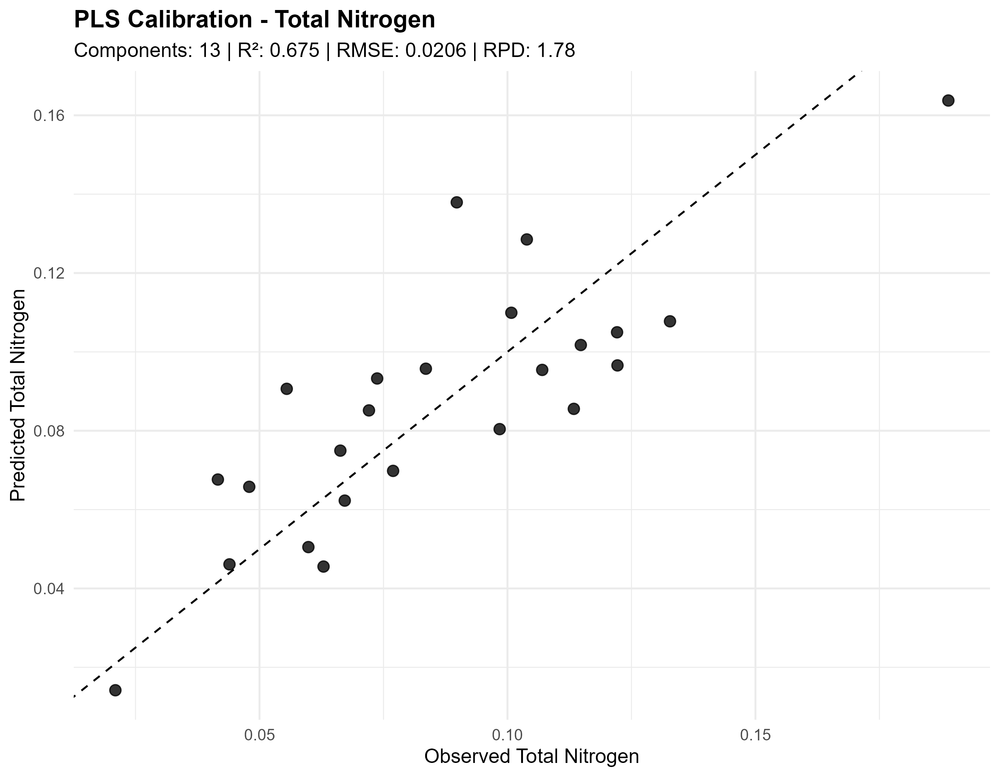
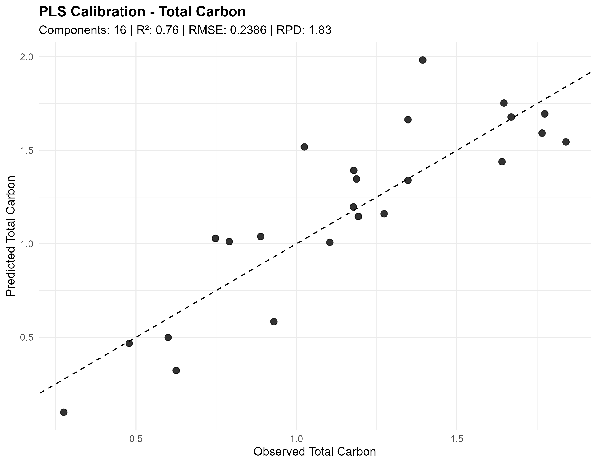
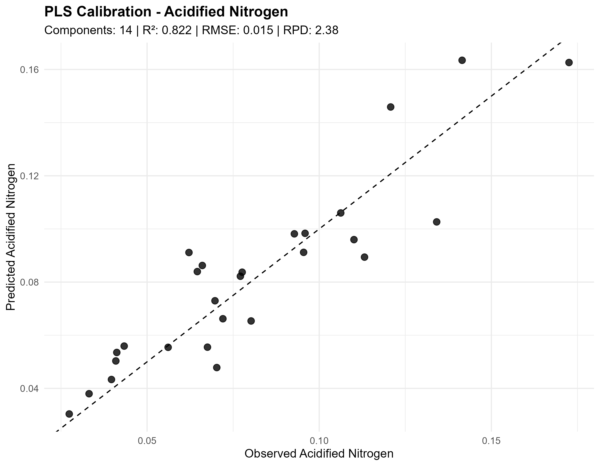
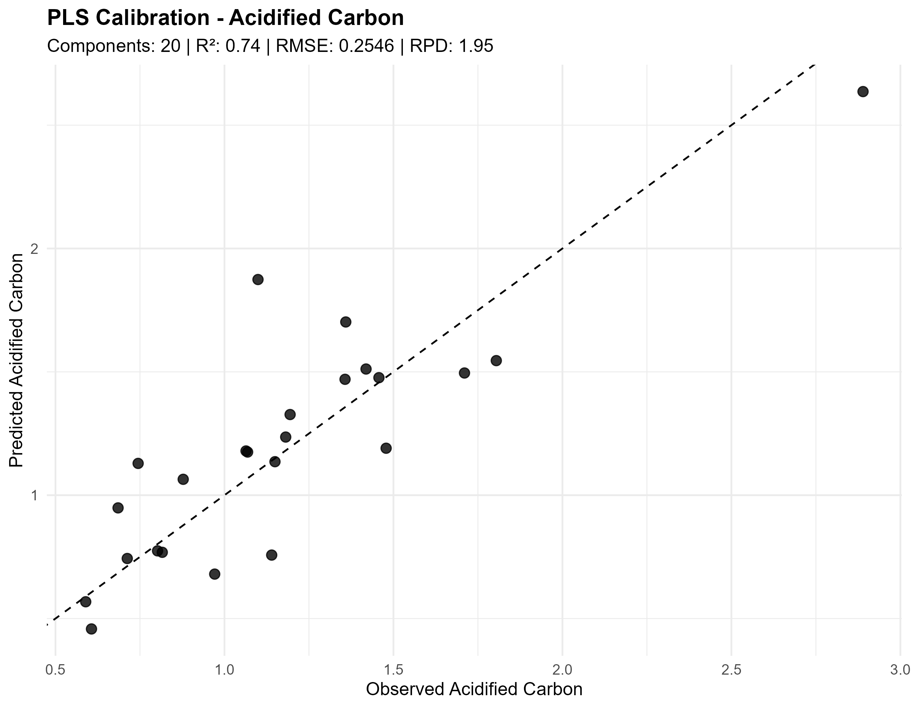

# Digital Soil Spectroscopy for Soil Health Assessment


## Overview

This repository demonstrates an end-to-end workflow for analyzing soil spectroscopy data using statistical and machine learning techniques. The project uses Mid-Infrared (MIR) spectra, laboratory reference measurements, and Portable X-Ray Fluorescence (pXRF) data collected from soil samples in Bungoma County, Kenya.

The objective is to evaluate the potential of digital soil spectroscopy for predicting soil properties and supporting soil health assessment.

---

## Objectives

- Import and clean soil spectroscopy datasets
- Explore laboratory reference data
- Perform spectral preprocessing
- Conduct Principal Component Analysis (PCA)
- Develop Partial Least Squares (PLS) regression models
- Compare PLS with Random Forest models
- Assess model performance using independent validation datasets
- Visualize spectral patterns and prediction accuracy

---

## Study Area

Bungoma County, Kenya

---

## Data Sources

The project integrates multiple datasets:

- MIR spectral data
- Laboratory reference soil properties
- Carbon and Nitrogen (CN) measurements
- Portable X-Ray Fluorescence (pXRF) data
- Calibration datasets
- Validation datasets

*Raw datasets are not included in this repository where they are subject to data ownership or confidentiality restrictions.*

---

## Project Workflow

1. Data Import
2. Data Cleaning
3. Exploratory Data Analysis
4. Spectral Preprocessing
5. Principal Component Analysis
6. Partial Least Squares Regression
7. Random Forest Modelling
8. Model Validation
9. Results Visualization
10. Reporting

---

## PLS Regression Calibration

Partial Least Squares (PLS) regression was used to develop predictive models for four soil properties using preprocessed MIR spectral data:

- Total Nitrogen
- Total Carbon
- Acidified Nitrogen
- Acidified Carbon

The models were evaluated using an independent test set and assessed using R², RMSE, and Ratio of Performance to Deviation (RPD).

### Model Performance

| Soil Property | PLS Components | R² | RMSE | RPD |
|---|---:|---:|---:|---:|
| Total Nitrogen | 13 | 0.675 | 0.0206 | 1.78 |
| Total Carbon | 16 | 0.760 | 0.2386 | 1.83 |
| Acidified Nitrogen | 14 | **0.822** | **0.0150** | **2.38** |
| Acidified Carbon | 20 | 0.740 | 0.2546 | 1.95 |

### PLS Calibration Results

#### Total Nitrogen



#### Total Carbon



#### Acidified Nitrogen



#### Acidified Carbon



### Key Finding

The Acidified Nitrogen model achieved the strongest overall predictive performance, with an R² of **0.822**, RMSE of **0.015**, and RPD of **2.38**.

## Software

- R
- RStudio

### Main Packages

- tidyverse
- prospectr
- pls
- caret
- randomForest
- ggplot2
- plotly
- janitor
- readr

---

## Repository Structure

```text
scripts/
figures/
reports/
dashboard/
presentation/
```

---

## Sample Outputs

- Raw MIR spectra
- PCA score plots
- Soil property distributions
- PLS prediction plots
- Random Forest performance
- Variable importance
- Model comparison

---

## Future Development

- Interactive Shiny Dashboard
- Power BI Dashboard
- Soil Nutrient Prediction App
- Spatial Mapping using QGIS
- Deep Learning Models

---

## Author

Gard Okello

Data Analyst | Soil Spectroscopy | Agricultural Data Science | Machine Learning

#Digital-Soil-Spectroscopy-for-Soil-Health-Assessment
│
├── data
│   ├── raw
│   ├── processed
│   └── metadata
│
├── scripts
│
├── figures
│
├── reports
│
├── dashboard
│
├── presentation
│
└── docs
