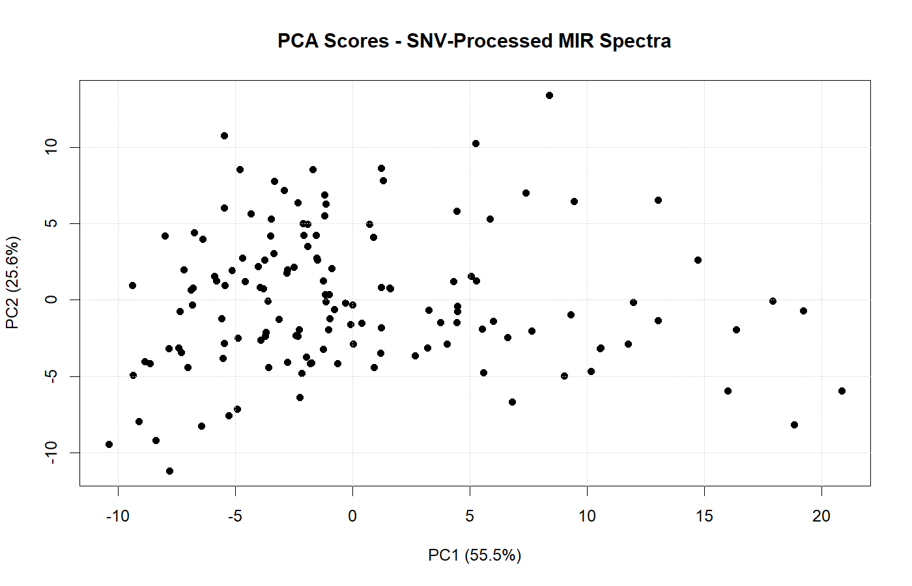
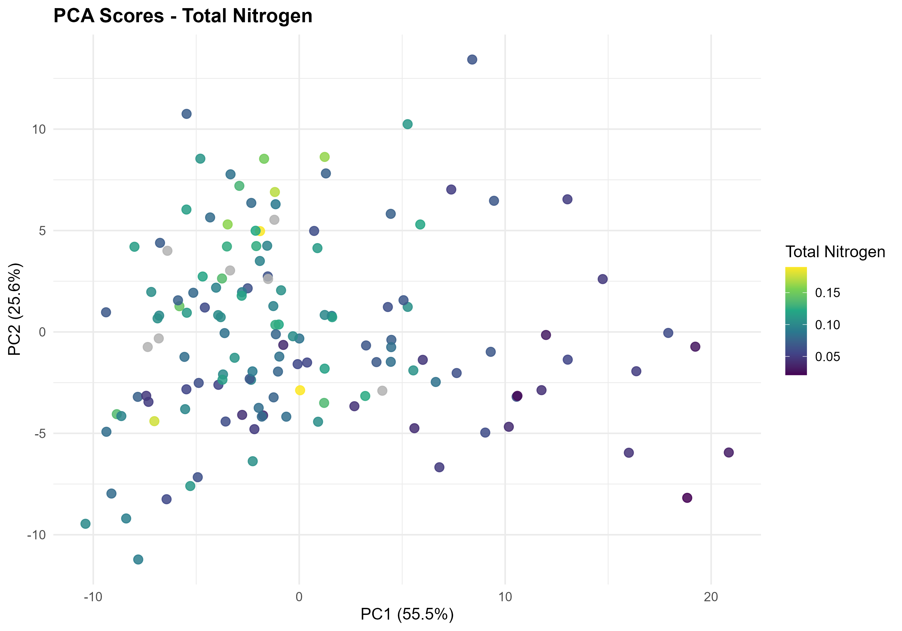
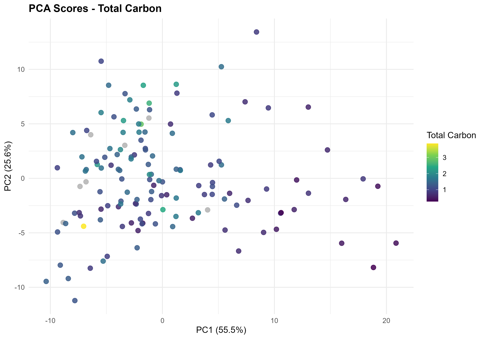
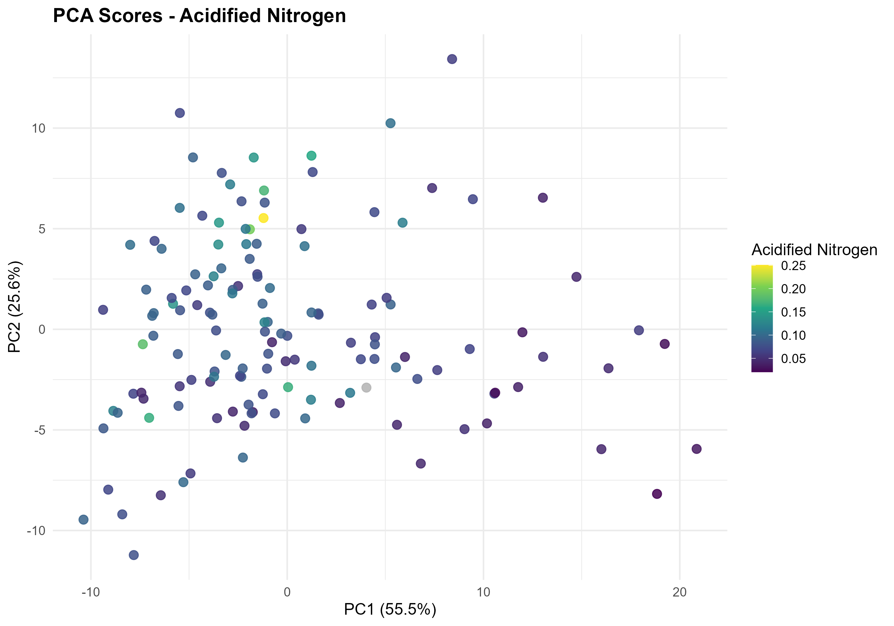
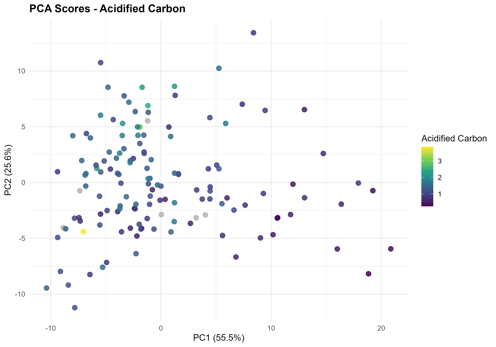
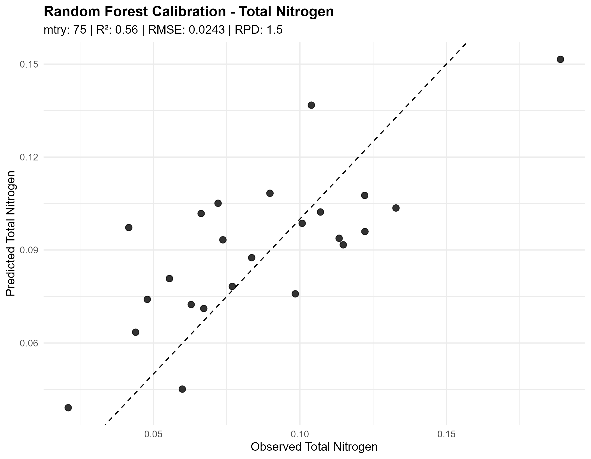
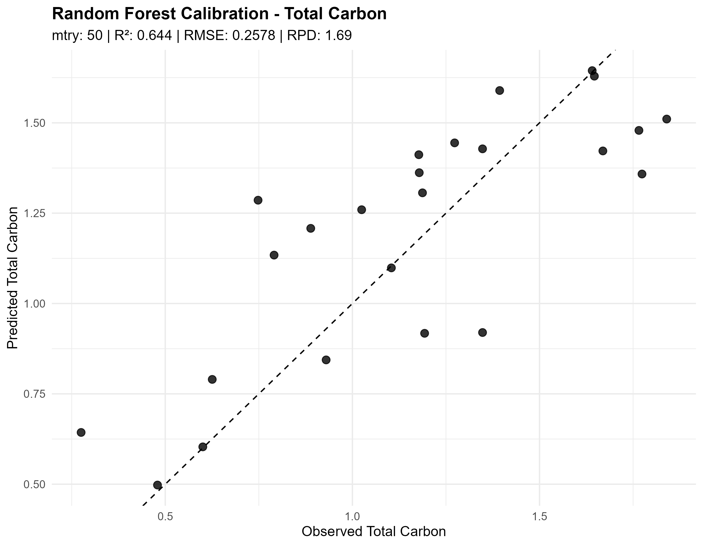
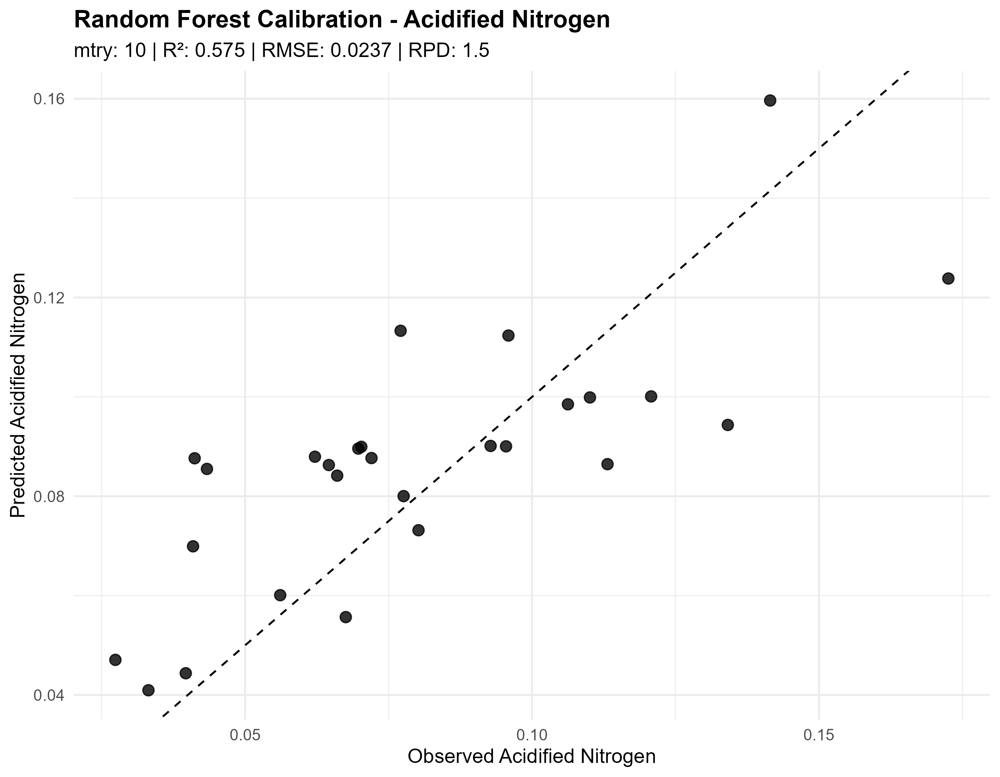
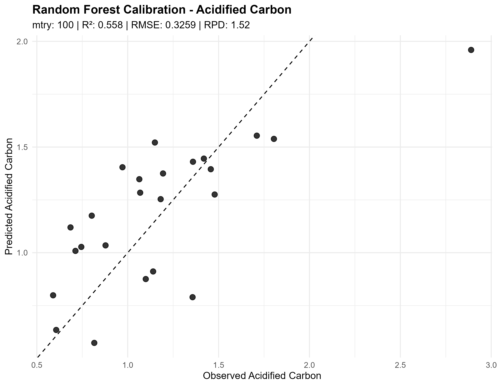
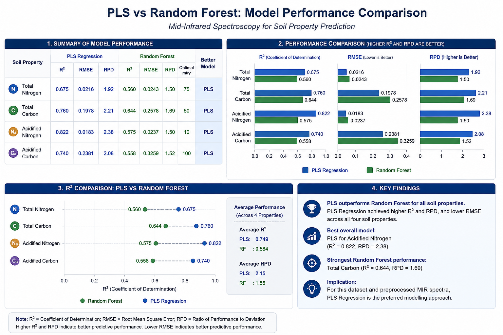

# Digital Soil Spectroscopy for Soil Health Assessment


## Overview

This repository demonstrates an end-to-end workflow for analyzing soil spectroscopy data using statistical and machine learning techniques. The project uses Mid-Infrared (MIR) spectra, laboratory reference measurements, and Portable X-Ray Fluorescence (pXRF) data collected from soil samples in Bungoma County, Kenya.

The objective is to evaluate the potential of digital soil spectroscopy for predicting soil properties and supporting soil health assessment.

---

## Key Results

- Processed MIR spectral data from 140 soil samples.
- Developed PLS regression models for four soil properties.
- Achieved the strongest predictive performance for Acidified Nitrogen (R� = 0.822, RPD = 2.38).
- Applied spectral preprocessing, PCA, cross-validation, and independent test-set evaluation.
- Generated reproducible visualizations and model-performance reports using R.

## Objectives

- Import and clean soil spectroscopy datasets
- Explore laboratory reference data
- Perform spectral preprocessing
- Conduct Principal Component Analysis (PCA)
- Develop Partial Least Squares (PLS) regression models
- Compare PLS with Random Forest models
- Assess model performance using independent validation datasets
- Visualize spectral patterns and prediction accuracy

---

## Study Area

Bungoma County, Kenya

---

## Data Sources

The project integrates multiple datasets:

- MIR spectral data
- Laboratory reference soil properties
- Carbon and Nitrogen (CN) measurements
- Portable X-Ray Fluorescence (pXRF) data
- Calibration datasets
- Validation datasets

*Raw datasets are not included in this repository where they are subject to data ownership or confidentiality restrictions.*

---

## Project Workflow

1. Data Import
2. Data Cleaning
3. Exploratory Data Analysis
4. Spectral Preprocessing
5. Principal Component Analysis
6. Partial Least Squares Regression
7. Random Forest Modelling
8. Model Validation
9. Results Visualization
10. Reporting

---

## Spectral Exploration

The raw Mid-Infrared (MIR) spectra were explored to assess spectral variation across the 140 soil samples. The spectra covered a wavenumber range of approximately 601.7-4001.6 cm-1, with 1,764 spectral variables.

### Raw MIR Spectral Signatures

The spectral signatures provide an overview of the variation captured across the MIR wavelength range before spectral preprocessing.


---

## Principal Component Analysis

Principal Component Analysis (PCA) was performed on the SNV-preprocessed MIR spectra to explore major patterns of spectral variation and reduce the dimensionality of the 1,764 spectral variables.

The first principal component (PC1) explained **55.51%** of the total variance, while PC2 explained **25.60%**. Together, the first two components explained **81.11%** of the spectral variance.

### PCA Score Plot



The PCA score plot shows the distribution of soil samples in the first two principal-component dimensions and provides an overview of spectral similarity and variation among samples.

### Property-Coloured PCA

PCA scores were additionally coloured according to laboratory reference measurements for the four target soil properties.

#### Total Nitrogen



#### Total Carbon



#### Acidified Nitrogen



#### Acidified Carbon



---

## PLS Regression Calibration

Partial Least Squares (PLS) regression was used to develop predictive models for four soil properties using preprocessed MIR spectral data:

- Total Nitrogen
- Total Carbon
- Acidified Nitrogen
- Acidified Carbon

The models were evaluated using an independent test set and assessed using R�, RMSE, and Ratio of Performance to Deviation (RPD).

### Model Performance

| Soil Property | PLS Components | R� | RMSE | RPD |
|---|---:|---:|---:|---:|
| Total Nitrogen | 13 | 0.675 | 0.0206 | 1.78 |
| Total Carbon | 16 | 0.760 | 0.2386 | 1.83 |
| Acidified Nitrogen | 14 | **0.822** | **0.0150** | **2.38** |
| Acidified Carbon | 20 | 0.740 | 0.2546 | 1.95 |

### PLS Calibration Results

#### Total Nitrogen


#### Total Carbon


#### Acidified Nitrogen


#### Acidified Carbon


### Key Finding

The Acidified Nitrogen model achieved the strongest overall predictive performance, with an R� of **0.822**, RMSE of **0.015**, and RPD of **2.38**.


## Random Forest Calibration

Random Forest regression was used as an alternative machine-learning approach for predicting the same four soil properties from preprocessed MIR spectral data:

- Total Nitrogen
- Total Carbon
- Acidified Nitrogen
- Acidified Carbon

The Random Forest models were optimized using cross-validation to determine the optimal number of variables randomly sampled at each split (`mtry`). Model performance was evaluated using an independent test set based on R�, RMSE, and Ratio of Performance to Deviation (RPD).

### Model Performance

| Soil Property      | Optimal mtry | R�    | RMSE   | RPD  |
| ------------------ | -----------: | ----: | ------: | ----: |
| Total Nitrogen     | 75           | 0.560 | 0.0243 | 1.50 |
| Total Carbon       | 50           | 0.644 | 0.2578 | 1.69 |
| Acidified Nitrogen | 10           | 0.575 | 0.0237 | 1.50 |
| Acidified Carbon   | 100          | 0.558 | 0.3259 | 1.52 |

### Random Forest Calibration Results

#### Total Nitrogen



#### Total Carbon



#### Acidified Nitrogen



#### Acidified Carbon




### Key Finding

Random Forest provided moderate predictive performance across the four soil properties. Total Carbon achieved the strongest Random Forest performance with an R� of 0.644 and RPD of 1.69.

Compared with the PLS models, Random Forest produced lower predictive performance for all four soil properties. This comparison demonstrates the importance of evaluating multiple modelling approaches when working with high-dimensional soil spectroscopy data.


## PLS vs Random Forest Comparison

The predictive performance of Partial Least Squares (PLS) regression and Random Forest models was compared across the four soil properties.

The comparison shows that PLS regression consistently outperformed Random Forest for the evaluated soil properties, with the strongest PLS performance observed for Acidified Nitrogen (R� = 0.822, RPD = 2.38).



### Key Insight

PLS regression demonstrated stronger predictive performance than Random Forest across all four evaluated soil properties under the modelling and validation setup used in this study.


## Software

- R
- RStudio

### Main Packages

- tidyverse
- prospectr
- pls
- caret
- randomForest
- ggplot2
- plotly
- janitor
- readr

---

## Repository Structure

```text
scripts/
figures/
reports/
dashboard/
presentation/
```

---

## Sample Outputs

- Raw MIR spectra
- PCA score plots
- Soil property distributions
- PLS prediction plots
- Random Forest performance
- Variable importance
- Model comparison

---

## Future Development

- Interactive Shiny Dashboard
- Power BI Dashboard
- Soil Nutrient Prediction App
- Spatial Mapping using QGIS
- Deep Learning Models

---

## Author

Gard Okello

Data Analyst | Soil Spectroscopy | Agricultural Data Science | Machine Learning | Research Assistant 